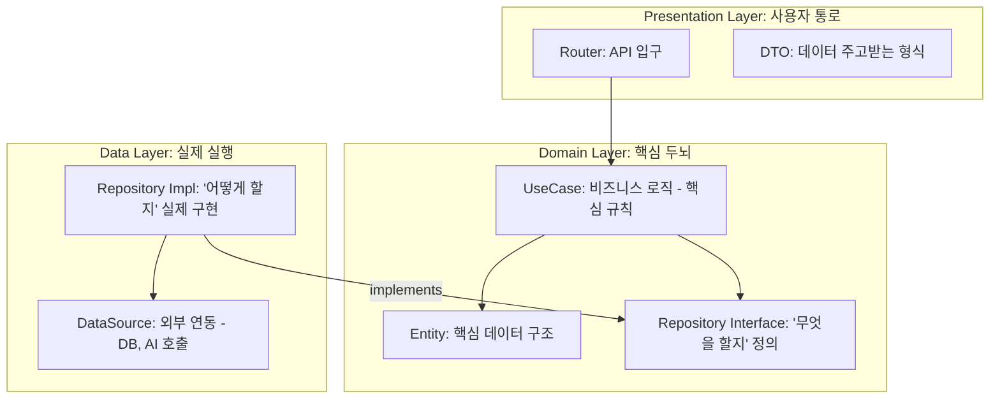

# 🗺️ 아키텍처 및 데이터 흐름 가이드

이 문서는 사용자의 요청이 우리 시스템의 어떤 계층을 거쳐 처리되는지 한눈에 보여줍니다.

## 🏗️ 전체 구조 (Clean Architecture Layer)

우리는 **LINE 기술 블로그** 표준에 따라 코드를 3개의 계층으로 분리했습니다.

---

## 🔄 데이터 처리 흐름 (Request Lifecycle)

리액트에서 버튼을 눌렀을 때 벌어지는 과정입니다.

1.  **Presentation (Router)**: 
    - 사용자의 요청(예: 채팅 메시지)을 받습니다.
    - 데이터가 올바른 형식(DTO)인지 확인하고 **UseCase**에게 전달합니다.
2.  **Domain (UseCase)**: 
    - 실제 비즈니스 로직을 실행합니다. 
    - 예: "이 대화는 위험한가?"를 판단하는 규칙 실행.
    - 실제 데이터 저장이나 AI 호출은 어떻게 되는지 몰라도 됩니다. 그냥 **Interface**를 부릅니다.
3.  **Data (Repository & DataSource)**: 
    - Interface의 지시를 받아 실제로 **MySQL**에 저장하거나 **OpenAI**에 질문을 던집니다.
    - 결과를 다시 한 땀 한 땀 위로 올려보냅니다.
4.  **최종 결과**:
    - 거꾸로 다시 올라온 데이터가 **Router**를 통해 리액트 화면으로 전달됩니다.

---

### 💡 왜 이렇게 어렵게 나누나요? (장점)
*   **교체가 쉽다**: 나중에 MySQL을 다른 DB로 바꾸고 싶을 때, 다른 계층은 건드릴 필요 없이 **Data Layer**만 바꾸면 됩니다.
*   **테스트가 쉽다**: AI 답변 기능을 테스트할 때, 실제 서버를 켜지 않고도 **Domain Layer** 로직만 따로 떼어내서 테스트할 수 있습니다.
*   **협업이 쉽다**: "저는 UI(Presentation)를 고칠게요, 당신은 AI 엔진(Data)을 고치세요"라고 분산해서 일하기 좋습니다.
 Lou
